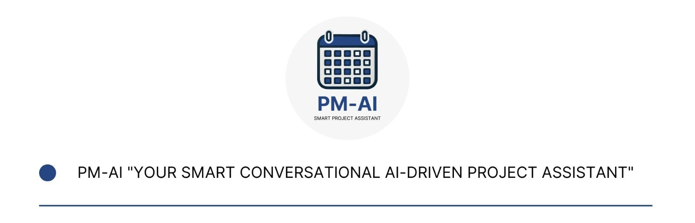

# PM AI – Your Smart AI-driven Project Assistant
## Overview

PM AI is an innovative, AI-driven assistant designed to streamline project management by automating meeting scheduling, task tracking, and real-time project insights. By leveraging IBM Granite Models, PM AI automates and optimizes business workflows with a focus on meeting management and task coordination. By reducing manual effort, it enhances efficiency and drives impactful innovation in workplace collaboration.

## HOW TO TEST

You can use the following commands:

/propose_project_meeting
/call
/tasks_from_transcript
/update_tasks_from_transcript
/transcript_qa

if you do not preload the initial state with all the tasks, you can try to load them by 
loading the file '1-kick-off-transcript.docx' (from this repo) in the upload button and type '/update_tasks_from_transcript'

You can inspect all the commands by typing "explain".

If you type /propose_project_meeting having the table of assignments compiled, the system will provide you a project schedule proposal.
Next, if you type /call, the system will send the google calendar invitation by the proposal, otherwise, by typing /call and a series of informations of the meeting (subject: str, agenda: str, start_date: str, end_date: str, participants: list), it will do the same job!

Also, by typing /transcript_qa, and loading a transcript of a videocall, you can ask questions about the meeting.

[See the demo here](https://drive.google.com/file/d/1siE9V999jLxHnroYAjs7MidB1Cif4TH7/view?usp=drivesdk)

## Key Features

- **Automated Meeting Scheduling:**  
  Proposes meeting details—including name, start/end dates, and agendas—by analyzing project history and syncing with participants’ calendars. The project manager can easily adjust the details and schedule the meeting in the first available time slot.

- **Meeting Minute Generation:**  
  Uses IBM Granite to automatically generate accurate meeting minutes directly from meeting transcripts, ensuring every discussion point is captured.

- **Dynamic Task Tracking:**  
  Updates task statuses in real time based on meeting minutes, so that all project activities are continuously and accurately tracked.

- **Smart Chat Interface:**  
  Provides a conversational platform where team members can get real-time project insights and collaborate effectively.

- **Integrated Dashboard:**  
  Displays key sections like project status, team details, chat functionality, and a sidebar with essential tools—making it easy for users to navigate and stay informed.

## How It Works

1. **Meeting Minute Generation:**  
   PM AI leverages IBM Granite Models to transform meeting transcripts into detailed meeting minutes, capturing decisions and action items without manual intervention.

2. **Task Status Updates:**  
   The assistant extracts relevant data from meeting minutes to update the project status and task list, keeping the entire team aligned with real-time insights.

3. **Meeting Scheduling:**  
   The AI proposes a comprehensive meeting schedule that includes the meeting name, start/end dates, and an agenda populated with task details. The project manager can modify and confirm the meeting details with ease.

4. **Real-Time Collaboration:**  
   A built-in smart chat interface facilitates immediate communication, enabling team members to discuss updates and resolve issues on the fly.

## Current Features and Enhancements

- **Automated Workflows:**  
  Significantly reduces manual efforts in meeting management and task coordination.
  
- **IBM Granite Integration:**  
  Utilizes advanced AI models to deliver reliable, context-aware automation for generating meeting minutes and updating project statuses.
  
- **User-Friendly Interface:**  
  Features a clear dashboard with distinct sections for project status, team information, chat, and essential tools accessible via a sidebar.

## Future Features and Expansions

- **Enhanced AI Capabilities:**  
  Continuous improvements to provide even more precise scheduling recommendations and task updates.

- **Advanced Analytics:**  
  Integration of comprehensive dashboards that offer deep insights into project performance and team productivity.

- **Broader Workflow Integrations:**  
  Support for additional project management tools and third-party integrations to further streamline business processes.

## Why PM AI?

In today’s fast-paced work environments, managing projects effectively is more challenging than ever. PM AI is designed to eliminate the friction of administrative tasks so that teams can focus on innovation and collaboration. By automating key project management processes, PM AI ensures that your team stays aligned, productive, and ready to tackle new challenges.

## Technologies Used

- **IBM Granite Models:**  
  For AI-driven automation and natural language processing.
- **[Additional Technologies]:**  
  Include any other frameworks or tools utilized in the project as applicable.

## Getting Started

To get started with PM AI:

1. **Clone the Repository:**
   ```bash
   git clone https://github.com/yourusername/pm-ai.git
